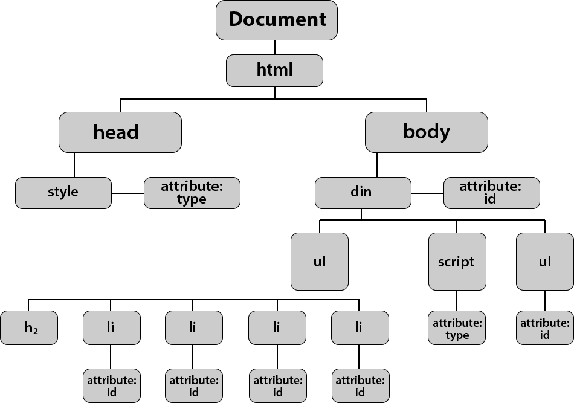

# React Full

## chapter 1
- why react ?
- to create single page application , optimiztion
- single page application --> those application which appear only one page in front
- can be used in multi page of react
- react is ui libaray based on reusable component 

